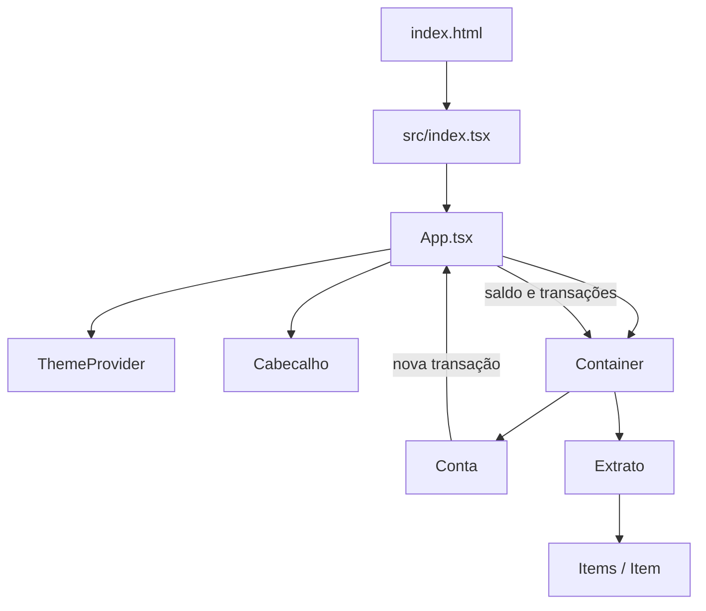

# Arquitetura do Smart Bank

## Visão geral

O Smart Bank é uma aplicação React executada inteiramente no navegador. Não existe backend, autenticação ou persistência de transações nesta versão.

O estado principal fica em `App.tsx` e é distribuído aos componentes por propriedades. Essa estrutura é adequada ao tamanho atual do projeto e evita adicionar uma biblioteca de estado sem necessidade.



## Responsabilidades

### Inicialização

- `index.html`: documento de entrada processado pelo Vite.
- `src/index.tsx`: encontra o elemento `#root` e inicializa o React em modo estrito.
- `src/App.tsx`: controla tema, transações e saldo calculado.

### Domínio e dados

`src/info.ts` declara:

- `TransactionCategory`: união das categorias permitidas;
- `Transaction`: contrato de uma transação;
- `categories`: lista usada pelo formulário e pelo filtro;
- `initialTransactions`: dados apresentados na primeira abertura.

O saldo é derivado, e não armazenado separadamente:

```text
saldo = soma(entradas) - soma(saídas)
```

Essa decisão evita inconsistências entre o extrato e o saldo exibido.

### Componentes

| Componente | Responsabilidade |
| --- | --- |
| `Cabecalho` | Exibe a identidade visual da aplicação. |
| `Container` | Organiza a página e encaminha dados aos painéis. |
| `Conta` | Exibe/oculta o saldo e cadastra novas transações. |
| `Extrato` | Pesquisa, filtra, ordena e pagina as transações. |
| `Items` | Renderiza a linha de uma transação e sua data. |
| `Item` | Renderiza categoria, descrição e valor formatado. |
| `ImageFilter` | Relaciona categorias aos ícones SVG. |
| `SwitherTema` | Exibe o ícone correspondente ao tema. |
| `UI` | Mantém componentes estilizados reutilizáveis. |

## Fluxo de uma nova transação

1. O usuário preenche o formulário em `Conta`.
2. O formulário valida campos obrigatórios e valor maior que zero.
3. Uma `Transaction` é criada com `crypto.randomUUID()`.
4. `Conta` chama `onAddTransaction`.
5. `App` adiciona o item ao estado.
6. React recalcula o saldo e atualiza o extrato.

O formulário não deve modificar diretamente a lista recebida por propriedades.

## Busca, filtro e ordenação

`Extrato` deriva uma lista por meio de `useMemo`:

1. filtra pela categoria selecionada;
2. compara a busca com descrição e categoria;
3. ordena pela data em ordem decrescente;
4. apresenta inicialmente cinco registros.

A busca usa regras de caixa de `pt-BR`. O botão “Ver mais” aumenta o limite em cinco itens.

## Temas

Os temas estão em `src/Components/UI/temas.ts` e seguem o contrato `DefaultTheme`, ampliado em `src/styled.d.ts`.

A preferência é gravada na chave `smart-bank-theme` do `localStorage`. Quando ainda não existe preferência, a aplicação consulta `prefers-color-scheme` do sistema operacional.

Para adicionar uma nova propriedade visual:

1. inclua-a na interface `DefaultTheme`;
2. defina um valor em `temaClaro` e `temaEscuro`;
3. consuma-a com `${({ theme }) => theme.propriedade}`.

## Testes

O Vitest é configurado em `vite.config.ts` com:

- ambiente `jsdom`;
- APIs globais de teste;
- matchers do `jest-dom` carregados por `src/setupTests.ts`.

Os testes atuais em `src/App.test.tsx` cobrem:

- busca no extrato;
- ocultação e reexibição do saldo.

Novos testes devem priorizar o comportamento observado pelo usuário, usando consultas por papel e nome acessível.

## Build e artefatos

`npm run build` executa:

```text
tsc -b → vite build → dist/
```

O TypeScript funciona como validação estática e não emite JavaScript. A transformação e otimização dos módulos ficam a cargo do Vite.

## Como evoluir a arquitetura

### Persistência local

Para uma versão sem backend, a inicialização e cada alteração de `transactions` podem ser sincronizadas com `localStorage`. Os dados recuperados devem ser validados antes do uso.

### Integração com API

Ao adicionar um backend:

1. crie `src/services/transactions.ts` para chamadas HTTP;
2. represente estados de carregamento e erro;
3. mantenha componentes visuais independentes do cliente HTTP;
4. valide respostas externas antes de incorporá-las ao estado.

### Crescimento do estado

Enquanto apenas `App`, `Conta` e `Extrato` compartilham dados, propriedades continuam sendo a opção mais simples. Considere Context ou uma biblioteca de estado somente quando muitos níveis ou áreas independentes precisarem acessar e alterar os mesmos dados.

## Limitações conhecidas

- as transações não sobrevivem ao recarregamento;
- não há autenticação ou isolamento por usuário;
- datas e valores são tratados apenas em reais e `pt-BR`;
- não existem edição, exclusão ou importação de lançamentos;
- os dados iniciais são estáticos.
